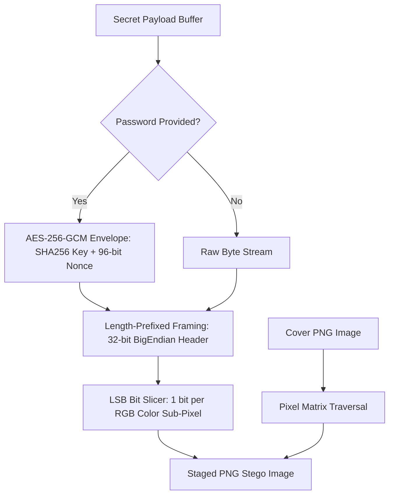

# Stegano

**LSB Image Steganography Utility with AES-256-GCM Envelope in Go**

[](https://github.com/ispectr3/stegano/actions/workflows/ci.yml)
[](LICENSE)
[](https://golang.org)
[](stego/crypto.go)

Stegano is a digital forensics and steganography tool written in Go that embeds and extracts arbitrary data within lossless PNG images using Least Significant Bit (**LSB**) manipulation. To prevent plaintext leakage and ensure integrity, payloads can be sealed with authenticated symmetric encryption (**AES-256-GCM**).

---

## Technical Mechanism



---

## Features

- **Lossless LSB Encoding**: Injects payload bits into the least significant bit of Red, Green, and Blue color channels without visible perceptual degradation.
- **Authenticated Encryption**: Optional AES-256-GCM encryption ensures hidden payloads cannot be decrypted or identified without the secret key.
- **Capacity Calculation**: Utility mode (`-mode capacity`) inspects image dimensions and calculates max embeddable payload size.
- **Pure Go Standard Library**: Uses Go's native `image/png` and `crypto/aes` packages with zero external C dependencies.

---

## Installation

### Prerequisites

- Go 1.21+

```bash
git clone https://github.com/ispectr3/stegano.git
cd stegano
go build -o stegano main.go
```

---

## Usage

### 1. Check Image Capacity

Determine maximum bytes embeddable in a target cover image:

```bash
./stegano -mode capacity -image cover.png
```

### 2. Embed Hidden Message (with AES-256 Encryption)

```bash
./stegano -mode encode \
  -image cover.png \
  -output stego.png \
  -message "Confidential Operations Plan" \
  -password "MySecretPassphrase"
```

### 3. Extract and Decrypt Hidden Message

```bash
./stegano -mode decode \
  -image stego.png \
  -password "MySecretPassphrase"
```

---

## Automated Testing

```bash
go test -v ./...
```

---

## License

Stegano is open-source software licensed under the [MIT License](LICENSE).
